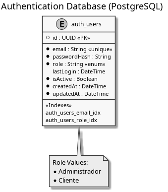
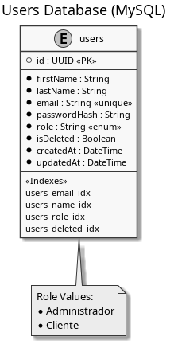

# StreamFlow API - Módulos de Autenticación y Usuarios

API monolítica modular para la plataforma de streaming StreamFlow, desarrollada como parte del Taller 1 de Arquitectura de Sistemas. Esta implementación corresponde a los módulos de Autenticación y Usuarios.

## Requisitos

- Node.js v18.x o superior
- PostgreSQL (módulo de autenticación)
- MySQL (módulo de usuarios)

## Instalación

1. **Clonar el repositorio e instalar dependencias**:
   ```bash
   git clone https://github.com/nico-alvz/taller1.git
   cd taller1
   npm install
   ```

2. **Configurar bases de datos**:
   - Crear una base de datos PostgreSQL para el módulo de autenticación
   - Crear una base de datos MySQL para el módulo de usuarios

3. **Configurar variables de entorno**:
   ```bash
   cp .env.example .env
   ```
   Edita el archivo `.env` con la siguiente información:
   ```
   # PostgreSQL (Auth DB)
   AUTH_DB_HOST=localhost
   AUTH_DB_PORT=5432
   AUTH_DB_NAME=auth_db
   AUTH_DB_USER=postgres
   AUTH_DB_PASSWORD=tu_contraseña

   # MySQL (Users DB)
   USERS_DB_HOST=localhost
   USERS_DB_PORT=3306
   USERS_DB_NAME=users_db
   USERS_DB_USER=root
   USERS_DB_PASSWORD=tu_contraseña

   # Configuración del servidor
   PORT=3000
   NODE_ENV=development
   JWT_SECRET=tu_clave_secreta
   JWT_EXPIRES=24h
   ```

4. **Verificar conexiones a bases de datos**:
   ```bash
   npm run test:db
   ```

5. **Ejecutar migraciones y seeds**:
   ```bash
   npm run migrate
   npm run seed
   ```

## Uso

### Iniciar el servidor

```bash
# Desarrollo con recarga automática
npm run dev

# Producción
npm start
```

## Estructura del Proyecto

```
.
├── src/
│   ├── config/         # Configuración de bases de datos
│   ├── controllers/    # Lógica de negocio
│   ├── models/         # Modelos de datos
│   ├── routes/         # Definición de rutas
│   ├── utils/          # Middlewares y utilidades
│   └── server.js       # Punto de entrada
├── tests/              # Pruebas automatizadas
└── .env.example        # Plantilla de variables de entorno
```

## Diagramas ER

El proyecto utiliza dos bases de datos separadas:

### Base de Datos de Autenticación (PostgreSQL)


### Base de Datos de Usuarios (MySQL)


## Endpoints

### Módulo de Autenticación

| Método | Ruta | Descripción | Acceso |
|--------|------|-------------|--------|
| POST | `/auth/login` | Iniciar sesión | Público |
| PATCH | `/auth/usuarios/:id` | Actualizar contraseña | Autenticado |

### Módulo de Usuarios

| Método | Ruta | Descripción | Acceso |
|--------|------|-------------|--------|
| POST | `/usuarios` | Crear usuario | Público/Admin* |
| GET | `/usuarios/:id` | Obtener usuario | Autenticado |
| PATCH | `/usuarios/:id` | Actualizar usuario | Autenticado |
| DELETE | `/usuarios/:id` | Eliminar usuario | Admin |
| GET | `/usuarios` | Listar usuarios | Admin |

*La creación de usuarios administradores requiere autenticación de administrador

## Credenciales por Defecto

**Administrador**:
- Email: admin@streamflow.com
- Password: Admin123!
